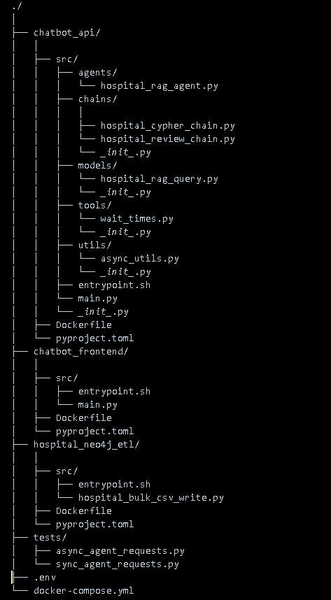

# Build an LLM Chatbot

This chatbot interfaces with a agent designed to answer questions about the hospitals, patients,
visits, physicians, and insurance payers in  a fake hospital system.The agent uses  retrieval-augment generation (RAG) over both
structured and unstructured data that has been synthetically generated.

## Flowchart


## Files Explaination




## Running Instructions 

Create a `.env` file in the root directory and add the following environment variables:

```.env
NEO4J_URI=<YOUR_NEO4J_URI>
NEO4J_USERNAME=<YOUR_NEO4J_USERNAME>
NEO4J_PASSWORD=<YOUR_NEO4J_PASSWORD>

OPENAI_API_KEY=<YOUR_OPENAI_API_KEY>

HOSPITALS_CSV_PATH=https://raw.githubusercontent.com/hfhoffman1144/langchain_neo4j_rag_app/main/data/hospitals.csv
PAYERS_CSV_PATH=https://raw.githubusercontent.com/hfhoffman1144/langchain_neo4j_rag_app/main/data/payers.csv
PHYSICIANS_CSV_PATH=https://raw.githubusercontent.com/hfhoffman1144/langchain_neo4j_rag_app/main/data/physicians.csv
PATIENTS_CSV_PATH=https://raw.githubusercontent.com/hfhoffman1144/langchain_neo4j_rag_app/main/data/patients.csv
VISITS_CSV_PATH=https://raw.githubusercontent.com/hfhoffman1144/langchain_neo4j_rag_app/main/data/visits.csv
REVIEWS_CSV_PATH=https://raw.githubusercontent.com/hfhoffman1144/langchain_neo4j_rag_app/main/data/reviews.csv

CHATBOT_URL=http://host.docker.internal:8000/hospital-rag-agent

HOSPITAL_AGENT_MODEL=llama3  # your model. I used my fine tunned model from ollama
HOSPITAL_CYPHER_MODEL=llama3
HOSPITAL_QA_MODEL=llama3
```

The three `NEO4J_` variables are used to connect to your Neo4j AuraDB instance. Follow the directions [here](https://neo4j.com/cloud/platform/aura-graph-database/?ref=docs-nav-get-started) to create a free instance.


Once you have a running Neo4j instance, and have filled out all the environment variables in `.env`, you can run the entire project with [Docker Compose](https://docs.docker.com/compose/). You can install Docker Compose by following [these directions](https://docs.docker.com/compose/install/).

Once you've filled in all of the environment variables, set up a Neo4j AuraDB instance, and installed Docker Compose, open a terminal and run:

```console
$ docker-compose up --build
```

After each container finishes building, you'll be able to access the chatbot api at `http://localhost:8000/docs` and the Streamlit app at `http://localhost:8501/`.


